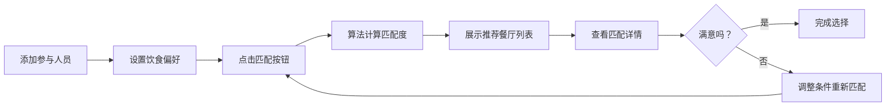

## 1. 产品概述
吃饭匹配神器是一款帮助团队解决聚餐选择难题的工具。用户可以录入每个人的饮食偏好和限制，系统智能匹配合适的餐厅，并标注可能存在的争议点。
- 核心解决问题：团队聚餐时众口难调的痛点
- 目标用户：公司同事、朋友群体、家人等需要集体用餐的人群
- 产品价值：快速达成共识，减少决策时间，提升聚餐体验

## 2. 核心功能

### 2.1 用户角色
| 角色 | 注册方式 | 核心权限 |
|------|----------|----------|
| 普通用户 | 无需注册，直接使用 | 添加/编辑参与人员、设置饮食偏好、查看匹配结果 |

### 2.2 功能模块
1. **首页**：添加参与人员、设置饮食限制、一键匹配餐厅
2. **匹配结果页**：展示推荐餐厅列表、匹配度评分、不满意提示
3. **餐厅详情**：餐厅详细信息、菜品推荐、各成员满意度分析

### 2.3 页面详情
| 页面名称 | 模块名称 | 功能描述 |
|-----------|-------------|---------------------|
| 首页 | 参与人员管理 | 添加人员姓名、选择饮食标签（辣度、忌口、素食等） |
| 首页 | 快速匹配按钮 | 一键触发餐厅匹配算法 |
| 匹配结果页 | 餐厅列表 | 按匹配度排序展示推荐餐厅，显示匹配度百分比 |
| 匹配结果页 | 不满意提示 | 对每个餐厅标注哪些成员可能不满意及原因 |
| 匹配结果页 | 重新匹配 | 支持调整条件后重新匹配 |

## 3. 核心流程
用户添加参与人员 → 为每个人设置饮食偏好（爱吃辣/不吃香菜/素食等）→ 点击匹配 → 系统算法计算 → 展示推荐餐厅列表 → 用户查看每个餐厅的匹配详情和潜在争议点 → 选择餐厅或重新匹配

## 4. 用户界面设计

### 4.1 设计风格
- 主色调：暖橙色系（#FF6B35），营造美食氛围
- 辅助色：暖黄色（#FFD166）、薄荷绿（#06D6A0）
- 按钮风格：圆润胶囊按钮，带微阴影和悬停动效
- 字体：标题使用 Poppins 粗体，正文使用 Inter
- 布局风格：卡片式布局，圆角设计，柔和阴影
- 图标风格：线性图标，emoji 增强视觉趣味

### 4.2 页面设计概述
| 页面名称 | 模块名称 | UI元素 |
|-----------|-------------|-------------|
| 首页 | 头部区域 | 大标题、美食主题插画、slogan |
| 首页 | 人员卡片 | 头像、姓名、标签式偏好展示、删除按钮 |
| 首页 | 添加表单 | 输入框、多选项、Tag选择器 |
| 匹配结果页 | 餐厅卡片 | 餐厅图片、名称、匹配度进度条、争议标签 |
| 匹配结果页 | 详情展开 | 成员满意度列表、各人口味分析 |

### 4.3 响应式
- 桌面端：双列布局，左侧人员管理，右侧快速预览
- 移动端：单列流式布局，适配触摸操作
- 断点：768px 切换为移动端布局

### 4.4 动效设计
- 页面加载：元素淡入+上移动画，错落延迟
- 卡片悬停：微微上浮，阴影加深
- 匹配按钮：点击后波纹扩散效果
- 结果展示：进度条从0到目标值的动画过渡
