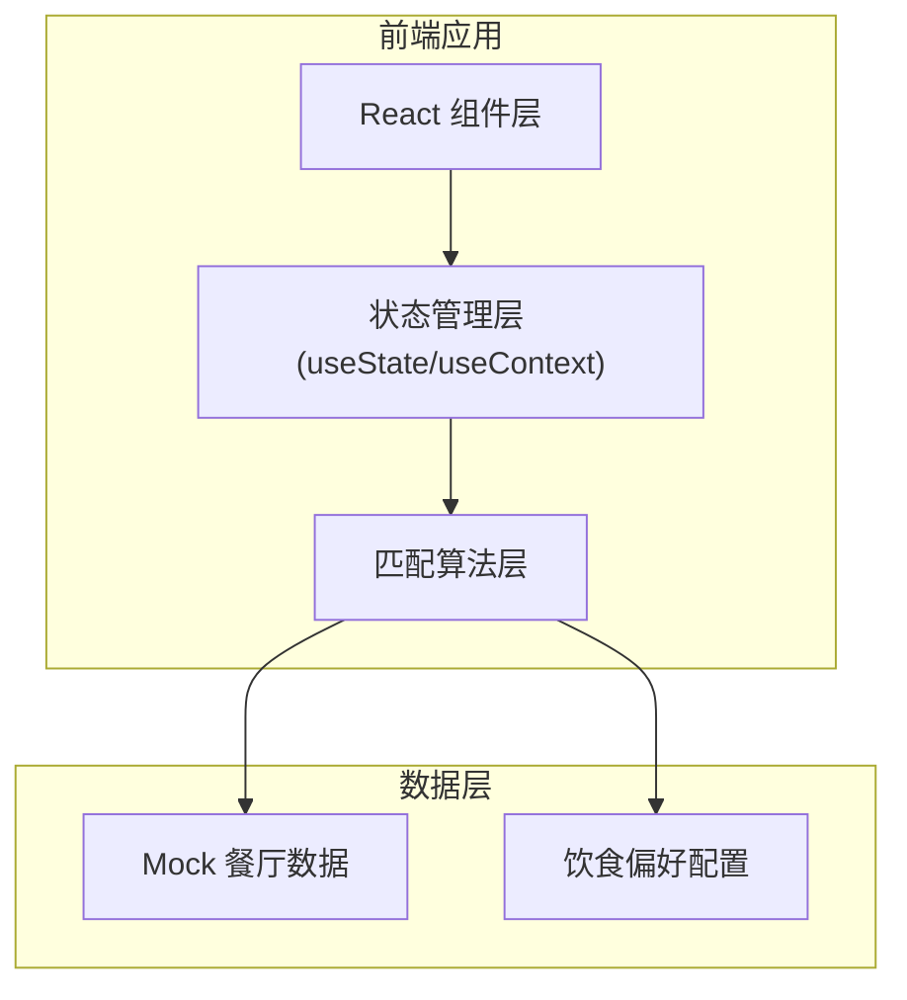

## 1. 架构设计



## 2. 技术描述
- 前端框架：React@18 + TypeScript
- 构建工具：Vite
- 样式方案：TailwindCSS@3
- 图标库：Lucide React
- 数据存储：本地 Mock 数据 + localStorage 持久化
- 部署方案：静态页面部署

## 3. 路由定义
| 路由 | 页面 | 用途 |
|-------|---------|---------|
| / | 首页 | 人员管理、偏好设置、发起匹配 |
| /results | 匹配结果页 | 展示推荐餐厅列表和匹配详情 |

## 4. 数据模型

### 4.1 人员数据结构
```typescript
interface Person {
  id: string;
  name: string;
  avatar: string;
  preferences: {
    spicyLevel: 0 | 1 | 2 | 3; // 0:不吃辣, 1:微辣, 2:中辣, 3:重辣
    isVegetarian: boolean;
    dislikes: string[]; // 忌口：香菜、葱、蒜等
    allergies: string[]; // 过敏源：海鲜、花生等
    favorites: string[]; // 喜欢的菜系
  };
}
```

### 4.2 餐厅数据结构
```typescript
interface Restaurant {
  id: string;
  name: string;
  image: string;
  cuisine: string; // 菜系
  spicyLevel: 0 | 1 | 2 | 3;
  hasVegetarianOptions: boolean;
  ingredients: string[]; // 常用食材
  tags: string[];
  rating: number;
  address: string;
}
```

### 4.3 匹配结果结构
```typescript
interface MatchResult {
  restaurant: Restaurant;
  matchScore: number; // 0-100
  satisfiedPeople: string[];
  dissatisfiedPeople: {
    personId: string;
    personName: string;
    reasons: string[];
  }[];
}
```

## 5. 核心算法设计

### 5.1 匹配度计算逻辑
1. **素食匹配**：素食者要求餐厅必须有素食选项（否决项）
2. **辣度匹配**：取所有人辣度的交集范围，餐厅辣度在范围内加分
3. **忌口检查**：餐厅常用食材包含忌口食物时扣分
4. **过敏源检查**：过敏源为否决项
5. **偏好加分**：菜系匹配个人喜好时加分

### 5.2 不满意点生成
- 对每个成员，检查是否存在忌口冲突
- 辣度超出个人接受范围时标注
- 素食者但餐厅素食选项有限时提示

## 6. 项目目录结构
```
src/
├── components/
│   ├── PersonCard.tsx
│   ├── AddPersonForm.tsx
│   ├── RestaurantCard.tsx
│   ├── MatchScore.tsx
│   └── DissatisfactionTags.tsx
├── data/
│   ├── restaurants.ts
│   └── preferences.ts
├── hooks/
│   └── useRestaurantMatcher.ts
├── types/
│   └── index.ts
├── utils/
│   └── matchAlgorithm.ts
├── pages/
│   ├── Home.tsx
│   └── Results.tsx
├── App.tsx
└── main.tsx
```
